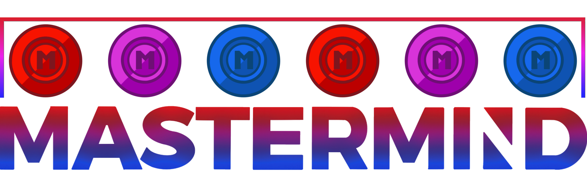
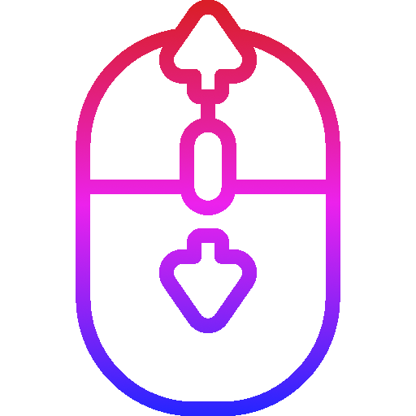
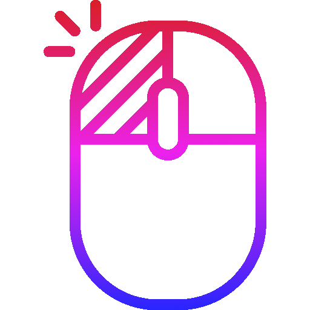
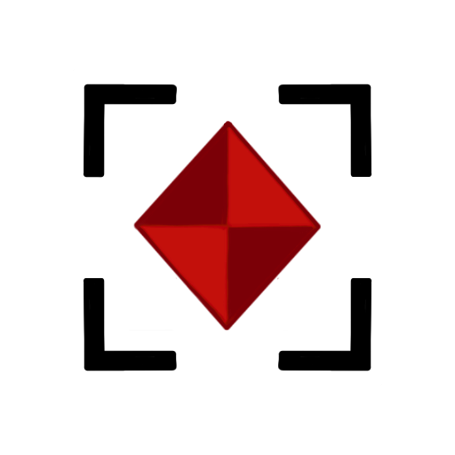

---


[](https://codecov.io/gh/LarsBuergerr/mastermind/tree/master)


[](https://cdn130.picsart.com/272563229032201.jpg?r1024x1024)


[](https://www.reddit.com/r/ich_iel/comments/aje7qh/ich_iel/)

---

## Description

This is a implementation of the game Mastermind. The game is played against the computer. The game creates a secret code of four to five stones (depends on the chosen difficult) . The layer tries to guess the code. After each guess the player gets feedback about how many stones are in the right position and how many stones are in the wrong position. The game ends when the player guesses the code or when the player has used all his tries.

## Commands

The following commands can be used in the TUI of the game:

| Command | Description | Example |
|---------|-------------|---------|
| `<stone><stone><stone><stone>` | Basic command to place a row of stones. | `rrrr` |
| `h` | Returns the help menu that shows all available commands. | 
| `save` | Saves the game into a json file. | `save` |
| `load` | Loads the game that was saved into the json file. | `load` |
| `dbsave <name>` | Saves the game into the database with the given name. | `dbsave game1` |
| `dbload <id>` | Loads the game with the given id. | `dbload 1` |
| `dbupdate <id>` | Updates the game with the given id. | `dbupdate 1` |
| `dbdelete <id>` | Deletes the game with the given id. | `dbdelete game1` |
| `dblist` | Lists all games with the name and the id that are currently saved in the data base. | `dblist` |


### Allowed Stone Colors that can be placed in the game

    Red (r), Green (g), Blue (b), Yellow (y), Purple (p), White (w)

## Setup

### Docker Compose

To set up the project using Docker Compose, follow these steps:

1. Install Docker and Docker Compose if you haven't already.
2. Start the Docker daemon.
3. Run the command: `sbt Docker/publishLocal` or `Docker/publishLocal` if you are already in the sbt shell in the root directory of the project.
    - The error chain in the output is okay and nothing to worry about.
5. Run the docker-compose file: `docker-compose up`
```bash 
docker-compose up 
``` 
6. In a seperate terminal, run the command: `docker attach ui_service` to attach the terminal to the TUI.
```bash 
docker attach ui_service
``` 
8. From here you can now use all the specified commands above to play the game normally.


## API URLs

The following APIs are available on `localhost` ports:

- API 1: [REST Controller API](http://localhost:8080)
- API 2: [REST Persistence API](http://localhost:8081)

The majority of the links can also be used to communicate with the Game and thus it can also be used to play the game.
Be aware that post commands like `save` and `dbsave` need a body to be sent with the request. The body should be a json object that contains a game json string, for that you can use the game.json file in the root directory and you should use postman for any post requests.

---

## Contributors
| [LarsBuergerr](https://github.com/LarsBuergerr)  | [SinusP-CW90](https://github.com/SinusP-CW90) |
|---|---|
|  |   |


## Usage

Explain how to use the project or provide any usage instructions. Include examples or code snippets if necessary.


## How to play
| Icon | Description               |
|-----------------|--------------------------------|
|  | <span style="font-size:larger;">Courser shows the current selected color which is used when placing stones</span> |
|  | <span style="font-size:larger;">Scroll down your mouse wheel to change the courser color and therefore the stone placing color</span> |
|  | <span style="font-size:larger;">Place your guess on an empty stone in the current row (see point below)</span> |
|  | <span style="font-size:larger;">Empty stone where you can place your hint (Shows the active row)</span> |
|  | <span style="font-size:larger;">Hint that shows you that you guess a right color but at the wrong position</span> |
|  | <span style="font-size:larger;">Hint that shows you that you guess a right color and at the right position</span> |

## Win/Lose
You won the game if you guess the secret code so that all hint stones are red. 
You lose the game if you used all your tries and you did not guess the secret code.

---

<!--- BRANCH 07 ONLY --->
## 07-Design Pattern Info

The following pattern are implemented:
### Strategy:
The strategy pattern was used to select a gamemode according to userinput. See the implementation [here](https://github.com/LarsBuergerr/mastermind/blob/07-DesignPattern/src/main/scala/de/htwg/se/mastermind/util/GameMode.scala)

### Factory:
The factory pattern replaces the original enum declaration of the stones. To show the difference the game-stones are implemented using the pattern, the hint-stones are still implemented as enum. See the implementation [here](https://github.com/LarsBuergerr/mastermind/blob/07-DesignPattern/src/main/scala/de/htwg/se/mastermind/model/Stone.scala)

### State:
The state pattern was used to keep track over current game state. There are events defined to switch the state of a game instance and methods to check the current state. See the implementation of the states [here](https://github.com/LarsBuergerr/mastermind/blob/07-DesignPattern/src/main/scala/de/htwg/se/mastermind/model/State.scala). The Events are defined [here](https://github.com/LarsBuergerr/mastermind/blob/07-DesignPattern/src/main/scala/de/htwg/se/mastermind/util/Event.scala). To switch between states there is a handler (called request) implemented in game class [here](https://github.com/LarsBuergerr/mastermind/blob/07-DesignPattern/src/main/scala/de/htwg/se/mastermind/model/Game.scala)

### Chain of Responsibility:
The Cain-of-Responsibility is used so analyze users input. See the implementation [here](https://github.com/LarsBuergerr/mastermind/blob/07-DesignPattern/src/main/scala/de/htwg/se/mastermind/util/Request.scala) and in the game class


---      
      
## Attribution
We thank the following people for their contributions to this project ( :) ):

| Creator         | Content               | Link |
|-----------------|-----------------------|------------|
| Smashicons      | Mouse Scroll Icon     | [Scroll Logo Template](https://www.flaticon.com/free-icon/scroll_3646197?term=mouse%20wheel&related_id=3646197)      |
| Dave Gandy      | Undo Icon             | [Undo Icon Template](https://www.flaticon.com/free-icon/undo-arrow_25249?term=undo&page=1&position=6&origin=search&related_id=25249)|
| Dave Gandy      | Reset Icon            | [Reset Icon Template](https://www.flaticon.com/free-icon/refresh-page-option_25429?related_id=25429&origin=pack)|
| Dave Gandy      | Save Icon             | [Save Icon Template](https://www.flaticon.com/free-icon/save-file-option_25398?related_id=25398&origin=pack)|
| Dave Gandy      | Load Icon             | [Load Icon Template](https://www.flaticon.com/free-icon/open-folder-outline_25402?related_id=25402&origin=pack)|
| Dave Gandy      | Help Icon             | [Help Icon Template](https://www.flaticon.com/free-icon/question-sign_25333?related_id=25333&origin=pack)|

---      